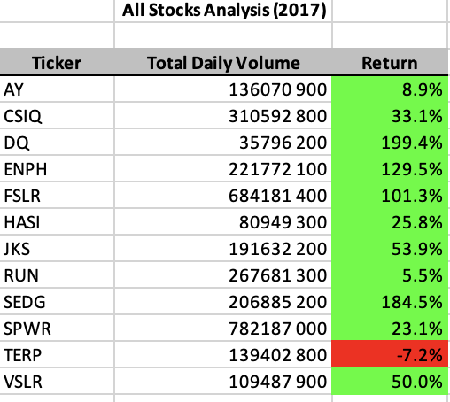
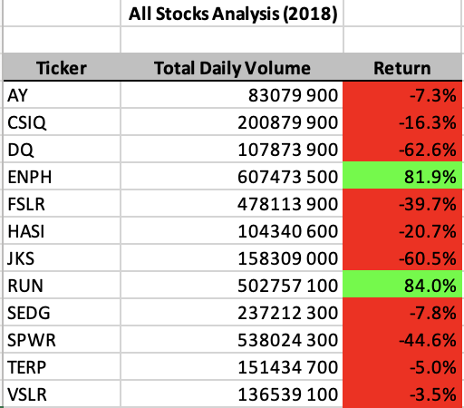

# Green-stocks Analysis

###### Written by: David Adams
###### Written on: January 26, 2021
###### Written with: Microsoft Excel VBA
###### Written for: Columbia University in the City of New York - Module 2

## Overview of the Project
_Purpose:_ The purpose of Module 2 was to understand the features of Excel and use a VBA script to execute those commands with macros. 

_Background:_ Specifically, this Module was meant to help Steve, who graduated with a finance degree, analyze the performance of a few green energy stocks from 2017 and 2018. Furthermore, I believe that his analysis would have also helped any stock enthusiast or his parents had they held onto the stocks until 2020 when Biden was elected president. 

## Results
### Analysis
2017 was a great year for the green energy stocks in the index. Each stock, except for ticker "TERP", rose in price for the year. Because I only analyzed the return for each of the stocks, the analysis doesn't take DRIP ("dividend re-investment programs"), stock purchase date, or stock sell date into account. However, understanding the total daily volume and return metrics are great first steps in analyzing the stock index's overall performance on the year.

The stocks fell dramatically in 2018 except for a couple of winners. Further analysis and understanding of ticker "ENPH" and "RUN" would likely tell a more powerful story as to why they succeded this year. Another stock in 2018 that would have made an excellent purchase is ticker "VSLR". It is a Utah company and I know they were recently purchased. The stock price soared and Steve's parents would have made more money on the green stock index I created for this assignment.

_Stock Recommendations:_ "ENPH", "RUN", "VSLR", and "DQ"
_2021 Stock Recommendations:_ "SEDG", "RUN", "TAN" (not included in the index), "CSIQ", "JKS", and "HASI" from https://www.investopedia.com/investing/top-solar-stocks/

### Code
```Sub allStocksAnalysis()
    Dim startTime As Single
    Dim endTime As Single
    
    yearValue = InputBox("What year would you like to run the analysis on?")
    
    startTime = Timer
    
    'Format the output sheet for All Stocks Analysis worksheet
    Worksheets("All Stocks Analysis").Activate
    
    Range("A1").Value = "All Stocks (" + yearValue + ")"
    
    'Add three columns with the following headers: Ticker, Total Daily Volume, Return
    Cells(3, 1).Value = "Ticker"
    Cells(3, 2).Value = "Total Daily Volume"
    Cells(3, 3).Value = "Return"
    
    'Initialize array of all tickers
    
    Dim tickers(12) As String
    
    tickers(0) = "AY"
    tickers(1) = "CSIQ"
    tickers(2) = "DQ"
    tickers(3) = "ENPH"
    tickers(4) = "FSLR"
    tickers(5) = "HASI"
    tickers(6) = "JKS"
    tickers(7) = "RUN"
    tickers(8) = "SEDG"
    tickers(9) = "SPWR"
    tickers(10) = "TERP"
    tickers(11) = "VSLR"
    
    '3A) Initialize variables for starting price and ending price
    Dim startingPrice As Double
    Dim endingPrice As Double
    
    '3B) Activate data worksheet
    Worksheets(yearValue).Activate
    
    '3C) Get the number of rows to loop over
    RowCount = Cells(Rows.Count, "A").End(xlUp).Row
    
    '4) Loop through tickers
    For i = 0 To 11
        ticker = tickers(i)
        totalVolume = 0
        
        '5) Loop through rows in the data
        Worksheets(yearValue).Activate
        For j = 2 To RowCount
            '5A) Find the total volume for current ticker
            If Cells(j, 1).Value = ticker Then
            
                totalVolume = totalVolume + Cells(j, 8).Value
            
            End If
            
            '5B) Find starting price for current ticker
            If Cells(j - 1, 1).Value <> ticker And Cells(j, 1).Value = ticker Then
            
                startingPrice = Cells(j, 6).Value
            
            End If
            
            '5C) Find ending price for current ticker
            If Cells(j + 1, 1).Value <> ticker And Cells(j, 1).Value = ticker Then
            
                endingPrice = Cells(j, 6).Value
            
            End If
            
        Next j
        
        '6) Output data for current ticker
        Worksheets("All Stocks Analysis").Activate
        Cells(4 + i, 1).Value = ticker
        Cells(4 + i, 2).Value = totalVolume
        Cells(4 + i, 3).Value = endingPrice / startingPrice - 1
        
    Next i
    
     endTime = Timer
            MsgBox "This code ran in " & (endTime - startTime) & " seconds for the year " & (yearValue)
    
End Sub
```
& because I didn't understand formatting, I created another subroutine to format Sub allStocksAnalysis() seen below.
```
Sub formatAllStocksAnalysis()
'Formatting
    Worksheets("All Stocks Analysis").Activate
        Range("A3:C3").Font.Bold = True
        Range("A3:C3").Borders(xlEdgeBottom).LineStyle = xlContinuous
        Range("B4:B15").NumberFormat = "#,##0"
        Range("C4:C15").NumberFormat = "0.0%"
        Columns("B").AutoFit
    
        'Setting the colors for the cells with a conditional
        dataRowStart = 4
        dataRowEnd = 15
        For i = dataRowStart To dataRowEnd
        
            If Cells(i, 3) > 0 Then
                'Color the cell green
                Cells(i, 3).Interior.Color = vbGreen
            
            ElseIf Cells(i, 3) < 0 Then
                'Color the cell red
                Cells(i, 3).Interior.Color = vbRed
            
            Else
                'Clear the cell color
                Cells(i, 3).Interior.Color = xlNone
            
            End If
        
        Next i

End Sub
```

### Refactored Code
```
Sub allStocksAnalysisRedone()

    Dim startTime As Single
    Dim endTime As Single
    
    yearValue = InputBox("What year would you like to run your analysis on?")
    
    startTime = Timer
    
    'Format the ouput sheet on All Stocks Analysis
    
    Worksheets("All Stocks Analysis").Activate
    
    Range("B1").Value = "All Stocks Analysis (" + yearValue + ")"
    Range("B1").Font.FontStyle = "Bold"
    Range("B1").HorizontalAlignment = xlCenter
    
    'Create a header row
    Cells(3, 1).Value = "Ticker"
    Cells(3, 2).Value = "Total Daily Volume"
    Cells(3, 3).Value = "Return"
    
    'Format header row
    Range("A3:C3").Interior.ColorIndex = 15
    Range("A3:C3").Font.FontStyle = "Bold"
    Range("A3:C3").HorizontalAlignment = xlCenter
    
    'Initialize array of all tickers
    Dim tickers(12) As String
    
    tickers(0) = "AY"
    tickers(1) = "CSIQ"
    tickers(2) = "DQ"
    tickers(3) = "ENPH"
    tickers(4) = "FSLR"
    tickers(5) = "HASI"
    tickers(6) = "JKS"
    tickers(7) = "RUN"
    tickers(8) = "SEDG"
    tickers(9) = "SPWR"
    tickers(10) = "TERP"
    tickers(11) = "VSLR"
    
    'Activate the worksheet where the data is available
    Worksheets(yearValue).Activate
    
    'Get the number of rows to loop over
    RowCount = Cells(Rows.Count, "A").End(xlUp).Row
    
    '1A Create a tickerIndex variable and set it equal to zero before iterating over all the rows.
    For i = 0 To 11
        tickerIndex = tickers(i)
    
    '1B Create three output arrays tickerVolumes, tickerStartingPrices, tickerEndingPrices
    Dim tickerVolumes As Long
    Dim tickerStartingPrices As Single
    Dim tickerEndingPrices As Single
    
    
    'Set tickerVolumes = 0
        Worksheets(yearValue).Activate
        tickerVolumes = 0
        
        '2B Create a for loop to initialize the tickerVolumes to zero
        
        For j = 2 To RowCount
        
            '3A inside the for loop initializing tickerVolumes write a script that increases tickerVolumes
            If Cells(j, 1).Value = tickerIndex Then
            
                'Increase volume for current ticker
                tickerVolumes = tickerVolumes + Cells(j, 8).Value
                
            End If
            
        '3B write a script that increases the tickerIndex if the next row's ticker doesn't match the previous row's ticker
            If Cells(j - 1, 1).Value <> tickerIndex And Cells(j, 1).Value = tickerIndex Then
            
                'Then assign tickerStartingPrices
                tickerStartingPrices = Cells(j, 6).Value
            
            End If
        
        '3C write a script that checks if the currentrow is the last row with the selected tickerIndex. If yes, assign tickerEndingPrices
        
            If Cells(j + 1, 1).Value <> tickerIndex And Cells(j, 1).Value = tickerIndex Then
            
                'Then assign the tickerEndingPrices
                tickerEndingPrices = Cells(j, 6).Value
                
            End If
            
        Next j
        
        'Format the cells for the All Stocks Analysis
        
        Worksheets("All Stocks Analysis").Activate
        
        Cells(4 + i, 1).Value = tickerIndex
        Cells(4 + i, 2).Value = tickerVolumes
        Cells(4 + i, 3).Value = tickerEndingPrices / tickerStartingPrices - 1
        
        'Fix the percentage on the "Return" column
        With Range("C4:C15")
        .NumberFormat = "0.0%"
        .Value = .Value
        End With
        
    Next i
    
    'Formatting the output sheet "All Stocks Analysis
    Worksheets("All Stocks Analysis").Activate
    Range("A3:C3").Font.FontStyle = "Bold"
    Range("A3:C3").Borders(xlEdgeBottom).LineStyle = xlContinuous
    Range("B3:B15").NumberFormat = "#, ##0"
    Columns("B").AutoFit
    
    dataRowStart = 4
    dataRowEnd = 15
    
    For i = dataRowStart To dataRowEnd
    
        If Cells(i, 3) > 0 Then
            
            Cells(i, 3).Interior.Color = vbGreen
            
        Else
        
            Cells(i, 3).Interior.Color = vbRed
            
        End If
        
    Next i
    
    endTime = Timer
    MsgBox "This code ran in " & (endTime - startTime) & " seconds for the year " & (yearValue)
    
End Sub
```
The refactored code includes the formatting loop. It also includes an index of stocks rather than a list of the stocks. I believe this will help compare the grouping of stocks to others in the future.

## Screenshots of the results from the Refactored Code


---




## Summary
### Statement about the advantages of refactoring the code in general
The advantages of refactoring the code are about consildating and grouping the code to run the same analysis. By doing so, the code is shorter and easier to read than the longer lines of code before it was refactored. Furthermore, it will help the analyst reuse the code in the future if Steve wants to analyze more stocks with the same measure.

### Statement about the disadvantages of refactoring the code in general
The disadvantages I see is that the code isn't as straightforward to understand for a beginning analyst, it is also not easily edited if something goes wrong. It is a little more complex and harder to deconstruct if that's ever necessary.

### Statement about the advantages of the orginal and refactored VBA script
By pseudocoding I could test my own knowledge of what the VBA script should look like. When I copy and pasted the code over to my workbook, it also caused a few errors when I ran the code. I found that it was best for me to pseudocode and then rewrite the VBA script in the editor on Excel. This way I would catch any error prior to it happending. I could also run a few lines of code at a time and see if it worked.

Lastly, this assignment took me a lot longer to understand. I finally understood it when I started to write and test the code line by line. 
